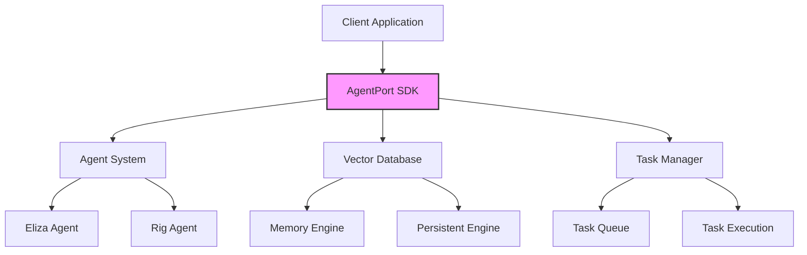

# AgentPort SDK

<div align="center">
  <p>🚀 Build, Deploy and Scale AI Agents with Ease</p>
  <a href="https://github.com/AgentPort/agentport-sdk/actions">
    
  </a>
  <a href="https://www.npmjs.com/package/agentport-sdk">
    
  </a>
  <a href="https://twitter.com/AgentPortSol">
    
  </a>
</div>

## 🌟 Features

- 🤖 **Flexible Agent System** - Build custom AI agents with powerful capabilities
- 🔍 **Vector Database** - Built-in vector storage and similarity search
- 🚅 **High Performance** - Optimized for speed and scalability
- 🛡️ **Type Safe** - Written in TypeScript with full type safety
- 🔌 **Extensible** - Plugin system for custom functionality
- 📦 **Easy Integration** - Simple API for quick integration

## 📊 Architecture



## 🚀 Quick Start

### Installation

```bash
npm install agentport-sdk
# or
yarn add agentport-sdk
```

### Basic Usage

```typescript
import { AgentPort, ElizaAgent, VectorDB } from 'agentport-sdk';

// Initialize SDK
const agentport = new AgentPort({
  apiKey: 'your-api-key',
  environment: 'production'
});

// Create an agent
const agent = await agentport.createAgent({
  type: 'eliza',
  config: {
    name: 'My Assistant',
    capabilities: ['conversation', 'task-management']
  }
});

// Process an instruction
const response = await agent.process({
  instruction: 'Help me organize my tasks',
  context: {
    userId: 'user-123',
    preferences: {
      language: 'en'
    }
  }
});

console.log(response);
```

### Vector Database Example

```typescript
import { VectorDB } from 'agentport-sdk';

// Initialize vector database
const vectorDB = new VectorDB({
  engine: 'memory',
  dimension: 1536,
  metric: 'cosine'
});

// Insert vector
await vectorDB.insert({
  id: 'doc-1',
  vector: new Float32Array(1536), // Your vector data
  metadata: {
    type: 'document',
    title: 'Example'
  }
});

// Search similar vectors
const results = await vectorDB.search({
  vector: new Float32Array(1536),
  limit: 5,
  threshold: 0.8
});
```

### Full Example with React

```tsx
import React, { useState } from 'react';
import { AgentPort } from 'agentport-sdk';

function AgentChat() {
  const [messages, setMessages] = useState([]);
  const [input, setInput] = useState('');
  const agentport = new AgentPort({ apiKey: 'your-api-key' });

  const handleSubmit = async (e) => {
    e.preventDefault();
    
    // Add user message
    setMessages(prev => [...prev, { type: 'user', content: input }]);
    
    // Process with agent
    const response = await agentport.agent('eliza').process({
      instruction: input,
      context: { history: messages }
    });
    
    // Add agent response
    setMessages(prev => [...prev, { type: 'agent', content: response.text }]);
    setInput('');
  };

  return (
    <div className="max-w-2xl mx-auto p-4">
      <div className="space-y-4 mb-4">
        {messages.map((msg, i) => (
          <div key={i} className={`p-3 rounded-lg ${
            msg.type === 'user' ? 'bg-blue-100 ml-auto' : 'bg-gray-100'
          }`}>
            {msg.content}
          </div>
        ))}
      </div>
      
      <form onSubmit={handleSubmit} className="flex gap-2">
        <input
          value={input}
          onChange={(e) => setInput(e.target.value)}
          className="flex-1 p-2 border rounded"
          placeholder="Type your message..."
        />
        <button 
          type="submit"
          className="px-4 py-2 bg-blue-500 text-white rounded"
        >
          Send
        </button>
      </form>
    </div>
  );
}

export default AgentChat;
```

## 📚 Documentation

For full documentation, visit [docs.agentport.fun](https://docs.agentport.fun)

### Core Concepts

- [Agents](docs/agents.md)
- [Vector Database](docs/vector-db.md)
- [Task Management](docs/tasks.md)
- [Authentication](docs/auth.md)
- [Error Handling](docs/errors.md)

### API Reference

- [API Documentation](docs/api.md)
- [TypeScript Types](docs/types.md)
- [Configuration](docs/config.md)

## 🛠️ Development

### Prerequisites

- Node.js 16+
- npm or yarn
- TypeScript 4.8+

### Setup

```bash
# Clone repository
git clone https://github.com/AgentPort/agentport-sdk.git

# Install dependencies
cd agentport-sdk
npm install

# Build
npm run build

# Run tests
npm test
```

### Running Examples

```bash
# Start example server
npm run example

# Open http://localhost:3000
```

## 🤝 Contributing

We welcome contributions! Please see our [Contributing Guide](CONTRIBUTING.md) for details.

### Development Process

1. Fork the repository
2. Create your feature branch (`git checkout -b feature/amazing-feature`)
3. Commit your changes (`git commit -m 'Add amazing feature'`)
4. Push to the branch (`git push origin feature/amazing-feature`)
5. Open a Pull Request

## 📈 Performance

Our latest benchmarks show:

- Vector search: ~10ms for 1M vectors
- Agent processing: ~100ms average response time
- Concurrent requests: Up to 1000 RPS

## 📄 License

MIT License

Copyright (c) 2024 AgentPort

Permission is hereby granted, free of charge, to any person obtaining a copy
of this software and associated documentation files (the "Software"), to deal
in the Software without restriction, including without limitation the rights
to use, copy, modify, merge, publish, distribute, sublicense, and/or sell
copies of the Software, and to permit persons to whom the Software is
furnished to do so, subject to the following conditions:

The above copyright notice and this permission notice shall be included in all
copies or substantial portions of the Software.

THE SOFTWARE IS PROVIDED "AS IS", WITHOUT WARRANTY OF ANY KIND, EXPRESS OR
IMPLIED, INCLUDING BUT NOT LIMITED TO THE WARRANTIES OF MERCHANTABILITY,
FITNESS FOR A PARTICULAR PURPOSE AND NONINFRINGEMENT. IN NO EVENT SHALL THE
AUTHORS OR COPYRIGHT HOLDERS BE LIABLE FOR ANY CLAIM, DAMAGES OR OTHER
LIABILITY, WHETHER IN AN ACTION OF CONTRACT, TORT OR OTHERWISE, ARISING FROM,
OUT OF OR IN CONNECTION WITH THE SOFTWARE OR THE USE OR OTHER DEALINGS IN THE
SOFTWARE.

## 📞 Support

- 📧 Email: support@agentport.fun
- 🐦 Twitter: [@AgentPortSol](https://twitter.com/AgentPortSol)
- 🌟 GitHub: [AgentPort/agentport-sdk](https://github.com/AgentPort/agentport-sdk)

## 🙏 Acknowledgments

Special thanks to all our contributors and the open source community!
